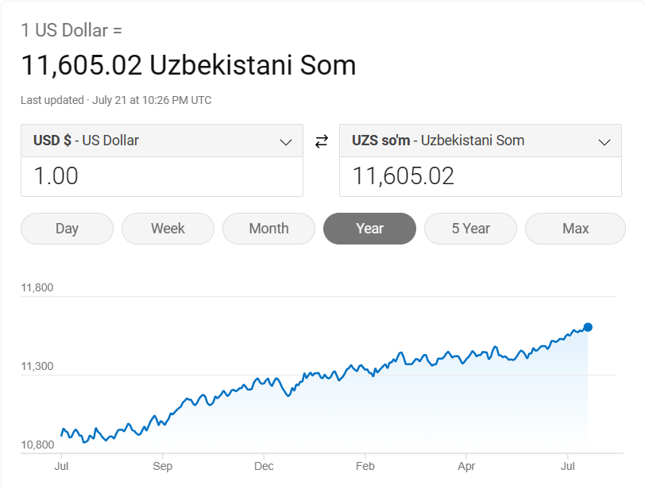

# Doviz
### Ultimate exchange tool to convert the value of dollar to uzbek soum and vice versa.
##
* Current value of dollar as soum 
         
 
](Assets/Images/image.png)
         
 
* This is how project works as video
         
 
<video src="Assets/Gifs/de9fd89d-a572-4773-a867-e682418415e9.mp4" controls title="!\[Alt text\](<ezgif.com-video-to-gif (1).gif>)"></video>

         
 
* This is how project works as gif
         
 

](<Assets/Images/ezgif.com-video-to-gif (1).gif>)
         
 
* [You can find the source code here](https://github.com/Aziz7574/Doviz)